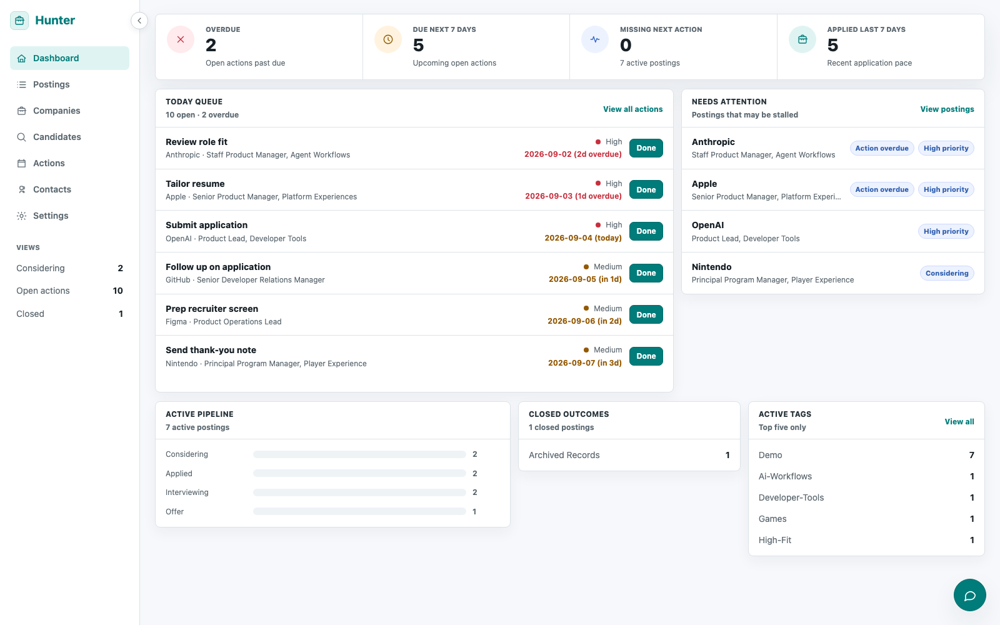
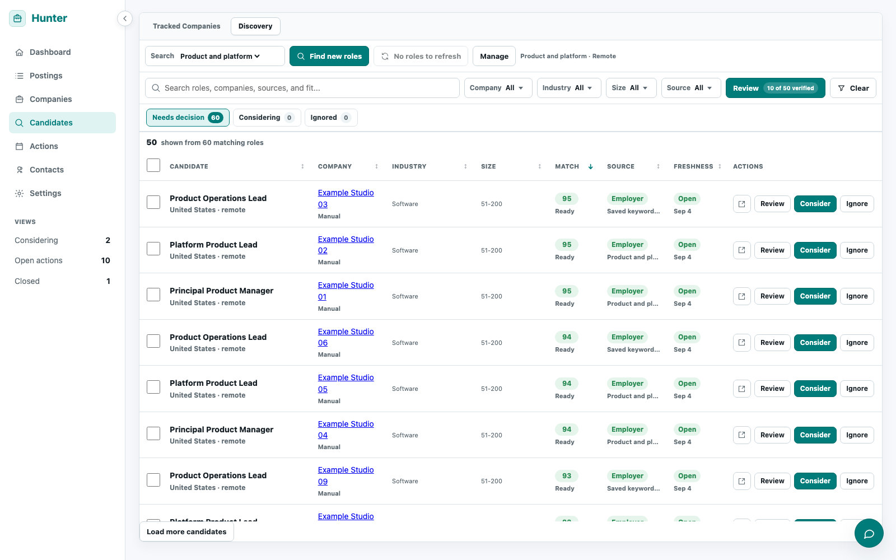

# Hunter

A local workspace for your job search.

Hunter brings job discovery, company research, saved postings, contacts, and next actions into one place. I built it for my own job search and am sharing the code for anyone who wants to explore it, adapt it, or run their own copy.

**Personal project · Runs locally · Work in progress · MIT licensed**



*Screenshots use fictional demo records. No personal job-search data is included.*

[See the postings view](docs/screenshots/postings.png)

## What it does

- **Keep track of opportunities.** Save postings, follow application stages, and keep a concrete next action attached to each active opportunity.
- **Review candidates in one inbox.** Discover roles, filter and sort the queue, inspect posting details, and decide what to pursue or ignore.
- **Follow companies.** Keep company notes, check supported careers pages, and manage which employers interest you.
- **Keep the context.** Link contacts, preserve posting descriptions, and keep notes alongside your work.
- **Use AI when it helps.** Optional provider-backed search, research, fit assessment, chat, and resume tailoring use settings you configure locally.
- **Work from the terminal or an agent.** The same workspace is accessible through a Python CLI and a local stdio MCP server.



## Run your own copy

You need **Python 3.10+**, **Node.js 22.12 or newer**, and npm. The backend uses Python's standard library; there is no separate database server to install.

```bash
git clone https://github.com/lganderson/hunter-agent.git
cd hunter-agent
python3 hunter.py init
npm --prefix app ci
npm --prefix app run build
python3 hunter.py serve 8010
```

Open **http://127.0.0.1:8010/**. Your workspace starts empty. The core tracker works without an AI provider key.

For a temporary demo after building the frontend:

```bash
python3 scripts/demo_preview.py
```

Open **http://127.0.0.1:4175/**. This creates a separate, disposable workspace with fictional records and removes it when the demo stops.

## Your data

App records live in a local SQLite database under `data/`. Provider settings, uploaded files, and exports also stay in ignored local directories.

Local does not mean every feature is offline: opening or importing posting URLs, checking careers pages, and using configured AI/search providers make network requests. Provider-backed features send the information needed for the requested operation, which can include resume text, posting content, or your question. You can use the tracker without configuring them.

## Built with

Python, SQLite, React, TypeScript, Vite, and TanStack Query. The interface is served by a local Python HTTP server. Tests use Python unittest, Vitest, and Playwright.

## Project status

Hunter follows my personal workflow and is still changing. Careers-site support varies, external sources can stop working, and AI-generated research or suggestions need review. This is a personal app shared publicly, with no hosted service or account system.

[Usage guide](docs/usage.md) · [Contributing](CONTRIBUTING.md) · [Local architecture](docs/local-architecture.md) · [Security](SECURITY.md) · [MIT license](LICENSE)
